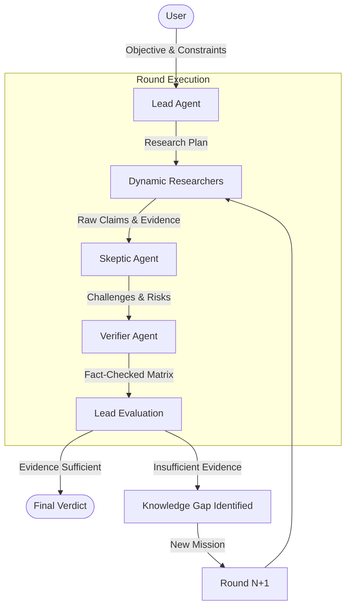
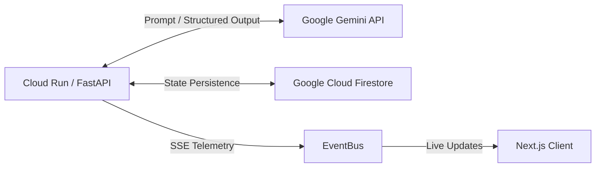
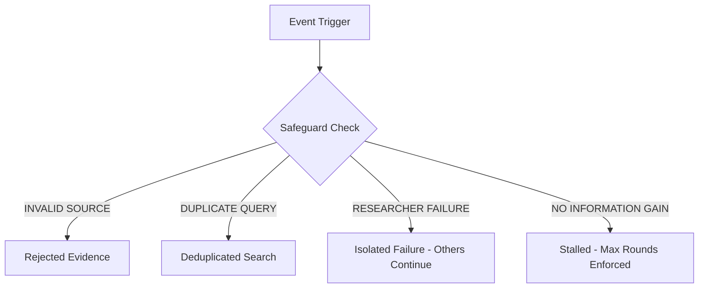

# VERDICT System Architecture

## Overview
VERDICT is an autonomous decision-research engine designed to evaluate complex objectives, gather empirical evidence, challenge key claims through skeptical analysis, independently verify disputed evidence, and converge recursively on a final verdict.

## Architectural Planes

### 1. INTERACTION PLANE
- **User Interface:** Next.js App Router, Tailwind CSS, React Three Fiber (R3F) for 3D visualizations, 2D fallback.
- **Client Communication:** REST API for commands, Server-Sent Events (SSE) for real-time telemetry.

### 2. CONTROL PLANE
- **API Routing:** FastAPI endpoints (`/api/investigations`).
- **Investigation Controller:** Orchestrates the multi-round `while` loop (up to `MAX_ROUNDS`).
- **EventBus:** Decoupled Pub/Sub broadcasting execution state to the SSE stream.

### 3. AGENT EXECUTION PLANE
- **Lead Agent:** Orchestrator powered by Gemini. Formulates strategy and evaluates findings.
- **Dynamic Researchers:** Specialist agents spawned concurrently based on the Lead's research plan.
- **Skeptic Agent:** Adversarial agent that challenges claims and searches for counter-evidence.
- **Verifier Agent:** Fact-checker that independently verifies disputed claims.

### 4. EVIDENCE / DECISION PLANE
- **Evidence Integrity:** Python-level safeguards blocking hallucinated URLs.
- **Evidence Matrix:** The consolidated state of Verified, Unverified, and Disproved claims.
- **Decision Engine:** The Lead Agent evaluates the matrix to either issue a Final Verdict or declare a Knowledge Gap.

### 5. INFRASTRUCTURE PLANE
- **AI Core:** Google `gemini-3.7-flash` via `google-genai` SDK.
- **State Store:** Google Cloud Firestore (durable round-by-round persistence).
- **Compute:** Google Cloud Run (serverless containerized execution).

---

## Core Execution Flow

---

## Infrastructure & Telemetry

---

## Failure Paths & Safeguards

