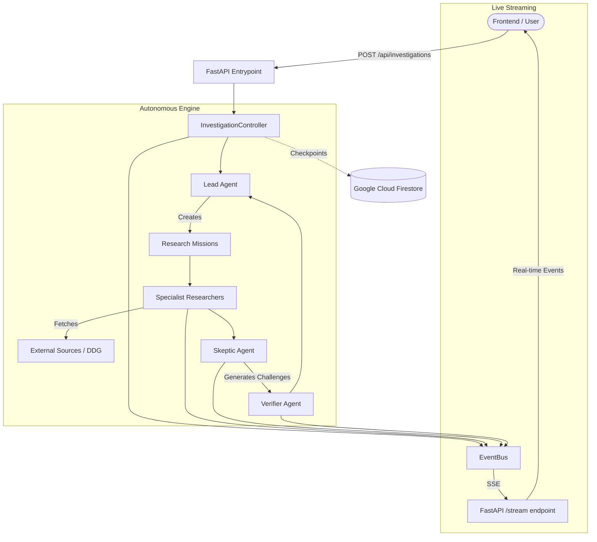

# VERDICT Architecture

VERDICT is structured as a decoupled backend orchestration engine exposing real-time state via FastAPI.

## Data Flow

## Key Components
- **API routes**: Manages background execution and SSE streams.
- **InvestigationController**: Executes the core recursive algorithm.
- **EventBus**: Asynchronous dispatcher. Allows arbitrary HTTP endpoints to subscribe dynamically.
- **FirestoreRepository**: Canonical persistent store. Ensures complete failure recovery via M6 checkpointing rules.
